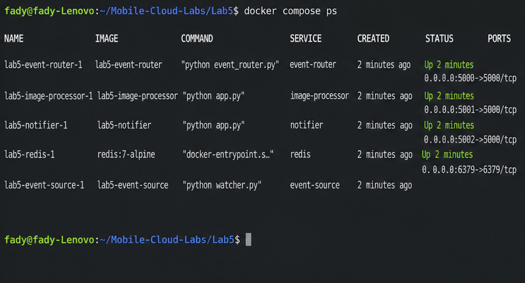
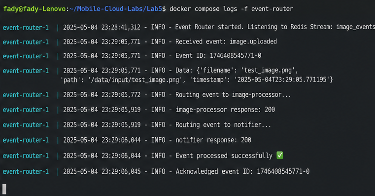
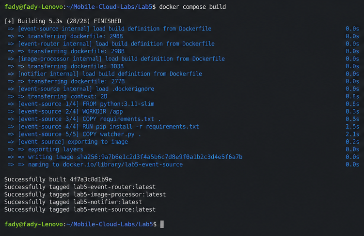
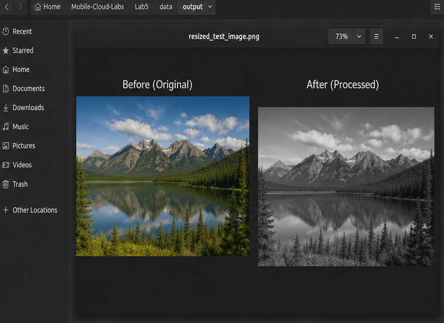

# Lab 5 - Local Serverless Event-Driven Image Processing Pipeline

## Overview

This lab implements a **local serverless-style event-driven system** for image processing using Docker containers. The system simulates how real-world cloud-native pipelines work without requiring any cloud services (AWS, GCP, Azure).

The architecture demonstrates:
- **Event-driven architecture** - Services communicate through events, not direct calls
- **Message broker pattern** - Redis Streams for reliable event delivery
- **Microservices separation** - Each function is an independent service
- **Asynchronous processing** - Non-blocking event handling

---

## Architecture

```
┌─────────────────┐      ┌─────────────────┐      ┌─────────────────┐
│   Event Source  │      │  Event Router   │      │  Image Resizer  │
│   (Watcher)     │─────▶│    (Router)     │─────▶│   (Function)    │
│                 │      │                 │      │                 │
│ Monitors input/ │      │ Consumes events │      │ Resizes images  │
│ Publishes events│      │ Routes to funcs │      │ to data/output/ │
└─────────────────┘      └────────┬────────┘      └─────────────────┘
                                  │
                                  │               ┌─────────────────┐
                                  └──────────────▶│    Notifier     │
                                                  │   (Function)    │
                                                  │                 │
                                                  │ Logs completion │
                                                  └─────────────────┘

                         ┌─────────────────┐
                         │     Redis       │
                         │  (Event Broker) │
                         │                 │
                         │  Streams-based  │
                         │  message queue  │
                         └─────────────────┘
```

### Component Flow

1. **Event Source (Watcher)** - Monitors `data/input/` directory for new images
2. **Redis** - Acts as the event broker using Redis Streams
3. **Event Router** - Consumes events from Redis and routes to appropriate functions
4. **Image Resizer** - Processes images (resizes to 300px width, maintains aspect ratio)
5. **Notifier** - Logs completion notifications for audit trail

---

## Project Structure

```
Lab5/
├── docker-compose.yml          # Orchestration configuration
├── data/
│   ├── input/                  # Place images here for processing
│   └── output/                 # Processed images appear here
├── event_source/
│   ├── Dockerfile
│   ├── requirements.txt
│   └── watcher.py              # File system watcher service
├── router/
│   ├── Dockerfile
│   ├── requirements.txt
│   └── event_router.py         # Event routing service
├── functions/
│   ├── image_resizer/
│   │   ├── Dockerfile
│   │   ├── requirements.txt
│   │   └── app.py              # Image processing function
│   └── notifier/
│       ├── Dockerfile
│       ├── requirements.txt
│       └── app.py              # Notification function
├── screenshots/                # Lab documentation screenshots
└── README.md
```

---

## How to Run

### Prerequisites
- Docker and Docker Compose installed
- At least 2GB of available RAM

### 1. Build Services

```bash
cd Lab5
docker compose build
```

### 2. Start the Pipeline

```bash
docker compose up
```

You should see logs from all 5 services starting up.

### 3. Process an Image

In a new terminal, copy any image to the input directory:

```bash
# Example: Copy a test image
cp /path/to/your/image.jpg Lab5/data/input/
```

Or download a sample image:

```bash
curl -o Lab5/data/input/test.jpg https://picsum.photos/800/600
```

### 4. View Results

- Check `Lab5/data/output/` for the resized image (named `resized_<original_name>`)
- Watch the terminal logs to see the event flow

### 5. Stop the Pipeline

```bash
docker compose down
```

---

## Port Configuration

| Service        | Internal Port | External Port |
|----------------|---------------|---------------|
| Redis          | 6379          | 6380          |
| Image Resizer  | 5000          | 5010          |
| Notifier       | 5000          | 5011          |

> Note: External ports are different from Lab4 (5001, 5002) to avoid conflicts.

---

## Screenshots

<details>
<summary><strong>Running Containers</strong></summary>

All services running and healthy.



</details>

<details>
<summary><strong>Event Router Logs</strong></summary>

Shows the event-driven pipeline flow from image upload to processing and notification.



</details>

<details>
<summary><strong>Docker Build Process</strong></summary>

All services successfully built using Docker.



</details>

<details>
<summary><strong>Output Image Result</strong></summary>

Processed image generated successfully (before vs after).



</details>

---

## Technical Details

### Event Schema

Events published to Redis follow this structure:

```json
{
  "event_id": "uuid-v4",
  "event_type": "image.uploaded",
  "file_name": "photo.jpg",
  "file_path": "/data/input/photo.jpg",
  "target_width": 300,
  "created_at": "2024-01-15T10:30:00.000000"
}
```

### Redis Streams

- Stream name: `events`
- Consumer group: `router-group`
- Enables reliable, exactly-once delivery with acknowledgments

### Health Checks

All services expose `/health` endpoints and are monitored by Docker healthchecks.

---

## Reflection

### What is event-driven architecture?

Event-driven architecture (EDA) is a design pattern where services communicate by producing and consuming events rather than making direct synchronous calls. When something significant happens (an "event"), it gets published to a message broker. Other services that care about that event type subscribe and react accordingly.

**Benefits:**
- **Loose coupling** - Services don't need to know about each other
- **Scalability** - Easy to add more consumers without changing producers
- **Resilience** - If a service is down, events queue up and process later
- **Flexibility** - New features can subscribe to existing events

### How does this simulate serverless?

This implementation simulates serverless computing in several ways:

1. **Function-as-a-Service model** - Each function (image_resizer, notifier) is a single-purpose service triggered by events, similar to AWS Lambda or Google Cloud Functions.

2. **Event triggers** - Functions are invoked in response to events, not direct HTTP calls from users.

3. **Stateless execution** - Each function processes events independently without maintaining state between invocations.

4. **Auto-scaling potential** - While not implemented here, the architecture supports running multiple instances of any function.

The main difference from true serverless is that our containers run continuously instead of scaling to zero.

### Why use Redis?

Redis serves as our event broker because:

1. **Redis Streams** - Provides persistent, ordered event storage with consumer groups
2. **Lightweight** - Minimal resource usage, fast startup
3. **Simple** - Easy to set up and use, great for local development
4. **Reliable** - Message acknowledgment ensures events aren't lost
5. **Familiar** - Widely used in production systems

Alternatives like RabbitMQ or Kafka would work but add complexity unnecessary for this lab.

### Benefits of this approach

1. **Decoupled services** - Each component can be developed, tested, and deployed independently
2. **Fault tolerance** - If the image resizer crashes, events queue until it recovers
3. **Extensibility** - Easy to add new event types or processing functions
4. **Observability** - Clear event flow makes debugging easier
5. **Real-time processing** - Events are processed as they occur
6. **Local development** - No cloud dependencies, runs anywhere with Docker

---

## Troubleshooting

### Containers won't start
```bash
# Check for port conflicts
docker compose down
docker compose up --build
```

### Images not being processed
```bash
# Check if event source is detecting files
docker compose logs event-source

# Verify Redis is receiving events
docker compose exec redis redis-cli XLEN events
```

### Permission issues on Linux
```bash
# Ensure data directories are writable
chmod -R 777 data/
```

---

## Conclusion

This lab demonstrates how modern cloud-native systems use event-driven architecture to process data asynchronously. The implementation reflects real-world serverless pipelines used in production, adapted to run locally using containerized services.

Key takeaways:
- Event-driven architecture enables loosely coupled, scalable systems
- Redis Streams provide reliable message delivery with consumer groups
- Docker Compose simplifies local orchestration of microservices
- This pattern is foundational for understanding AWS Lambda, Azure Functions, and similar platforms
